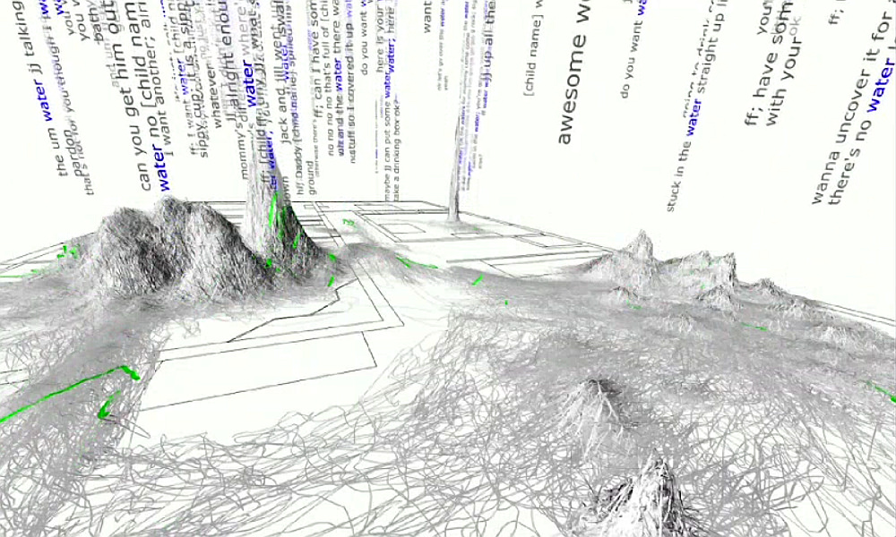

## Instructores:

- [Juan Pablo Soto Barrera]()
- [Julio Waissman Vilanova](http://mat.uson.mx/~juliowaissman/)

## Objetivos

El taller tiene como objetivo mostrar, instalar y comprender el uso básico de
algunas de las herramientas computacionales utilizadas comúnmente para el manejo
y procesamiento de grandes volúmenes de datos, dando énfasis a la escalabilidad
y al procesamiento masivo.

Dado que el curso es de corta duración, se presentaran las ideas generales sobre
los temas a tratar y se complementará con información adicional, así como
ejercicios propuestos para practicar los diferentes temas que vamos a revisar.

Este taller se encuentra en continuo proceso de revisión, por lo que te
recomendamos visitar (o actualizar si clonaste el proyecto directamente de
*github*) la página principal en cada ocasión.

## Contenido

1. [¿Qué es el *Big Data*?](intro.pdf)
2. [Contenedores *Docker*](docker/)
3. [Libretas *Jupyter* para investigación reproducible](jupyter/)
4. [*Spark* y manejo de flujo de datos](spark/)
5. [*Tableau* y la importancia de presentar la información]()
6. [*Tensorflow* como método para calculo numérico escalable](tensorflow/)

